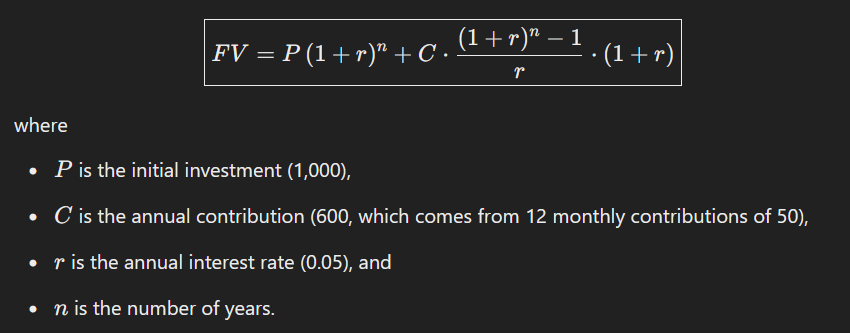

# Investment Calculator

## A repository for a bonus assignment for OOP course

## Task:

**Investment calculator**

Your task is to create an tool to calculate investment returns with compound interest, which runs in the browser.

The tool should have input fields for

- initial investment
- monthly contribution
- length of time in years
- estimated interest rate in percent

As a result the tool should show how your investment value grows over the years. Use a table for this. Assume interest is added annually at the end of the year.

In the result table show the yearly investment value with interest and without interest (total contributions of savings).

With initial values of 1000 initial investment, 50 monthly contribution, 5 years time and 5 percent in the table should have the following values:

<table>
<tr style="font-weight: bold">
<td>Years</td>
<td>Investment Value (5.00%)</td>
<td>Total Contributions</td>
</tr>
<tr>
<td>Year 0</td>
<td>1,000.00</td>
<td>1,000.00</td>
</tr>
<tr>
<td>Year 1</td>
<td>1,680.00</td>
<td>1,600.00</td>
</tr>
<tr>
<td>Year 2</td>
<td>2,394.00</td>
<td>2,200.00</td>
</tr>
<tr>
<td>Year 3</td>
<td>3,143.70.00</td>
<td>2,800.00</td>
</tr>
<tr>
<td>Year 4</td>
<td> 3,930.85</td>
<td>3,400.00</td>
</tr>
<tr>
<td>Year 5</td>
<td>4,757.43</td>
<td>4,000.00</td>
</tr>
</table>

## My workflow

I did the first version of this task right after doing DOM exsercise 4.

<p>
    <br>
    <em>Figure 1. Initial formula generated by GhatGpt 4o.</em>
</p>

I used ChatCPT to understand the formula of the investment value over time calculation.

My implementation of this fomula:

```js
let investmentValue =
	initialInvestment * Math.pow(1 + interestRate / 12 / 100, 12 * year) +
	((monthlyContribution * (Math.pow(1 + 5 / 100 / 12, 12 * year) - 1)) / (interestRate / 100)) * 12;
```

But the result did not match the example provided:

<p>
    <br>
    <em>Figure 2. First results.</em>
</p>

I did some testing and finally I got an updated formula:

<p>
    <br>
    <em>Figure 3. Updated formula</em>
</p>
 
My implementation:

```js
// function to calculate investment value
function getInvestmentValue(initialInvestment, monthlyContribution, interestRate, year) {
	let annualContribution = monthlyContribution * 12;
	let interestRateDecimal = interestRate / 100;
	let investmentValue =
		initialInvestment * Math.pow(1 + interestRateDecimal, year) +
		(annualContribution * (1 + interestRateDecimal) * (Math.pow(1 + interestRateDecimal, year) - 1)) /
			interestRateDecimal;
	return investmentValue;
}
```

<p>
    <br>
    <em>Figure 4. Updated results</em>
</p>
